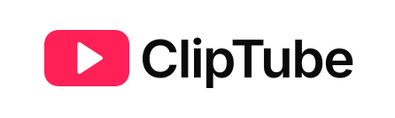

# Clip Tube

A full-featured video-sharing platform. Users can upload videos, engage with content through likes, comments, and playlists, and navigate a sleek, responsive interface. Powered by **Next.js App Router**, **TRPC**, **Drizzle ORM**, **Mux**, and more.


---

## Tech Stack

- **Frontend**: Next.js (App Router), TypeScript, Tailwind CSS, ShadCN UI
- **Backend**: TRPC, Drizzle ORM, UploadThing, Redis
- **Database**: PostgreSQL via Drizzle ORM
- **Video Hosting**: Mux
- **Authentication**: Clerk
- **Deployment**: Vercel

---

## Features

-  User auth (OAuth & JWT via Clerk)
-  Upload and stream videos via Mux
-  Mux video player with views tracking
-  Comments, replies, and reactions
-  Like/dislike functionality for videos and comments
-  Playlist creation and management
-  Trending and subscribed feeds
-  Video and user search
-  TRPC-powered type-safe backend
-  Fully responsive layout

---

##  Folder Structure Overview

├─ app/ # Route handlers (App Router)
├─ modules/ # App features with respective tRPC procedures (videos, comments, playlists, etc.)
├─ components/ # Reusable UI (ShadCN + a couple custom-made)
├─ db/ # Drizzle schema & DB init
├─ lib/ # Mux, Redis, Upload helpers
├─ trpc/ # Routers and API logic
├─ hooks/ # Custom React hooks
├─ scripts/ # Seeders (e.g., categories)

---

##  Getting Started

Clone the repo:

```bash

git clone https://github.com/wikkiboi/cliptube.git
cd cliptube
bun install

```

Create .env.local and add the following:

```env
NEXT_PUBLIC_CLERK_PUBLISHABLE_KEY=
CLERK_WEBHOOK_SIGNING_SECRET=

DATABASE_URL=

UPSTASH_REDIS_REST_URL=
UPSTASH_REDIS_REST_TOKEN=

MUX_TOKEN_ID=
MUX_TOKEN_SECRET=
MUX_WEBHOOK_SECRET=

UPLOADTHING_TOKEN=
```

Run the app locally:

```bash

bun run dev

```
